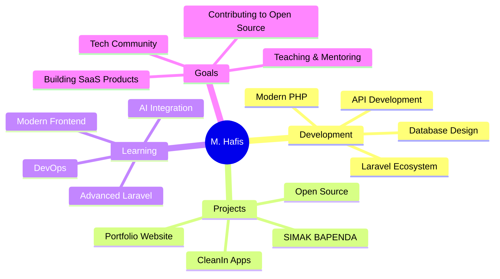
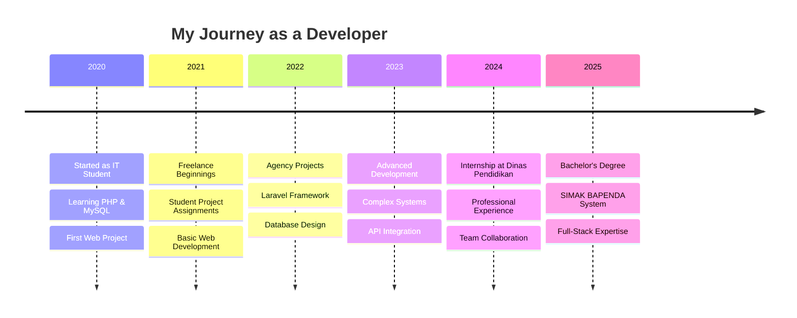

# 👋 Hai, saya M. Hafis!

<div align="center">
  
  [](https://git.io/typing-svg)
  
  
  
</div>

## 🚀 About Me

```typescript
const hafis = {
  name: "M. Hafis",
  location: "Pekanbaru, Indonesia 🇮🇩",
  education: "Sarjana Teknik Informatika",
  experience: "3+ Years",
  
  currentWork: {
    role: "Freelance Web Developer",
    focus: ["Web Development", "System Management", "Digital Solutions"],
    passion: "Creating innovative solutions with modern tech"
  },
  
  workingOn: {
    primary: "SIMAK BAPENDA - PKL Management System",
    side: ["CleanIn Apps", "Campus Event Platform"],
    learning: ["Advanced Laravel", "AI Integration", "Modern Frontend"]
  },
  
  askMeAbout: ["PHP", "Laravel", "MySQL", "Web Development", "System Design"],
  
  funFact: "I love turning complex problems into simple, elegant solutions! 🎯"
};
```

<div align="center">
  
  
  
  <br/>
  
  [](https://github.com/fixxyinhere)
  [](https://github.com/fixxyinhere)
  [](https://github.com/fixxyinhere)
  
</div>

## 🛠️ Tech Arsenal

<div align="center">

### 💻 Languages & Frameworks


### 🗄️ Databases & Tools


### 🎨 Design & Creative


### 🤖 AI & Productivity


</div>

## 📊 GitHub Analytics

<div align="center">
  
  
</div>

<div align="center">
  
</div>

<div align="center">
  
</div>

## 🏆 Featured Projects

<div align="center">

<a href="https://github.com/fixxyinhere/cleanin-apps">
  
</a>

<a href="https://github.com/fixxyinhere/campus-event-website">
  
</a>

<a href="https://github.com/fixxyinhere/simak-bapenda">
  
</a>

<a href="https://github.com/fixxyinhere/internship-registration-system">
  
</a>

</div>

## 🎯 Current Focus

<div align="center">



</div>

## 🏅 Achievements & Stats

<div align="center">

| 📊 Stat | 📈 Value |
|---------|----------|
| 🎯 **Projects Completed** | 20+ |
| 💼 **Years Experience** | 3+ |
| 😊 **Happy Clients** | 20+ |
| 📚 **Technologies Mastered** | 15+ |
| 🔥 **Contribution Streak** |  |

</div>

## 🎮 Fun Zone

<div align="center">

### 🐍 Contribution Snake
<!-- The snake will eat your contributions! -->

### 💻 Coding Activity
<!--START_SECTION:waka-->
<!--END_SECTION:waka-->

### 🎵 Spotify Playing
[](https://open.spotify.com/user/31k6rlup4btfkk5b3gkj4lod6aaq)

</div>

## 🌟 Professional Journey

<div align="center">



</div>

## 📈 Contribution Graph

<div align="center">
  
</div>

## 🤝 Let's Connect!

<div align="center">

[](https://hafis-portfolio.vercel.app)
[](https://linkedin.com/in/muhammad-hafis/)
[](https://instagram.com/muhammadhfs_)
[](mailto:mhafis383@gmail.com)
[](https://wa.me/6288271209442)

### 💬 Ask me about PHP, Laravel, Web Development, or anything tech-related!

</div>

---

<div align="center">

### 🎨 "Code is poetry written in logic"


**Thank you for visiting my profile! Let's build something amazing together! 🚀**


</div>

<!-- Easter Egg: You found the hidden message! Thanks for reading till the end 🎉 -->

<!-- 
Future Additions:
- GitHub Actions for automated updates
- More interactive widgets
- Real-time coding stats
- Dynamic project showcase
- Personalized README based on visitor
-->/.
